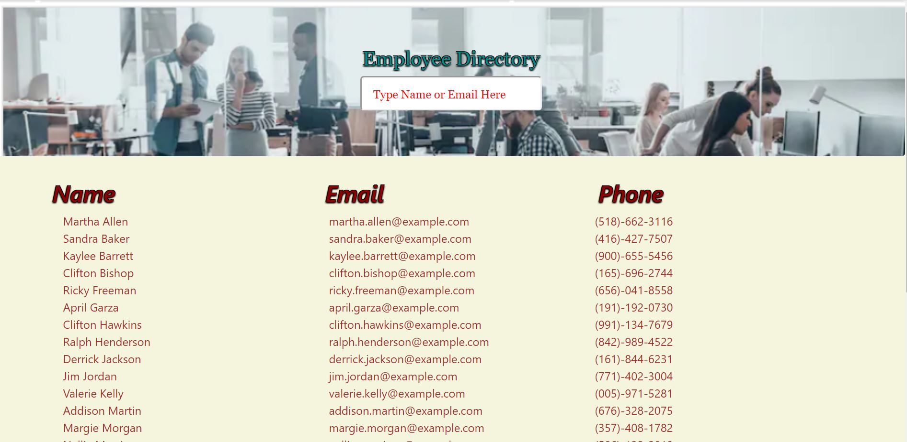

## React Employee Directory
Filter and sort an employee directory dynamically

   

## Description
This application uses react to create a responsive webpage with filtering and sorting capability.
        
# Table of contents
1. [Installation](#installation)
2. [Usage](#usage)
3. [License](#license)
4. [Contributing](#contributing)
5. [Tests](#tests)
6. [Questions](#questions)

## Installation <a name="installation"></a>
The following dependencies need to be installed

```
npm i react, react-dom, react-scripts
```
Additionally, must run on chrome, with file structure as follows:
root
    public
        index.html
        manifest.json
    src
        components
            Directory.js
            Employee.js
            Search.js
        images
            office.png
        styles
            Directory.css
            Employees.css
            Search.css
        App.css
        App.js
        index.css
        index.js
        serviceWorker.js


## Usage <a name="usage"></a>
As a user, I want to be able to view my entire employee directory at once so that I have quick access to their information.

An employee or manager would benefit greatly from being able to view non-sensitive data about other employees. It would be particularly helpful to be able to filter employees by name.

## License <a name="license"></a>
None.

## Contributing <a name="contributing"></a>
None
        
## Tests <a name = "tests"></a>

```
none

```

## Questions <a name ="questions"></a>
 

If you have an questions about the repo, open an issue or contact [randrmoel](https://api.github.com/users/randrmoel)
at my email: robert.moel@rvmconsulting1.com